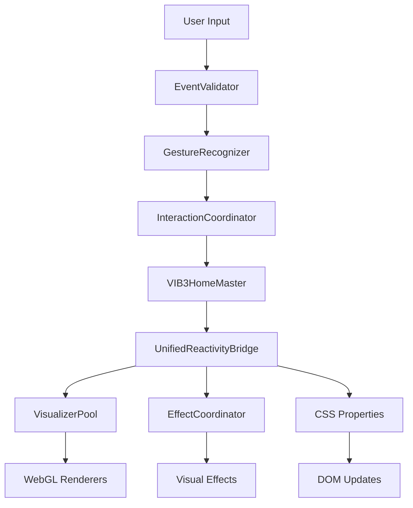

# VIB34D ARCHITECTURE SPECIFICATION
## **Clean Hierarchical System for Intensive UI/Event Coordination**

### 🏗️ **SYSTEM HIERARCHY**

```
VIB34D SYSTEM CONTROLLER (Top Level)
├── CORE SYSTEMS (Single Source of Truth)
│   ├── VIB3HomeMaster - Central state authority
│   ├── UnifiedReactivityBridge - Multi-layer coordination
│   └── SystemOrchestrator - Lifecycle management
│
├── INTERACTION LAYER (User Event Processing)
│   ├── InteractionCoordinator - Event routing & throttling
│   ├── GestureRecognizer - Mouse/touch/keyboard patterns
│   └── EventValidator - Input sanitization & filtering
│
├── VISUAL MANAGERS (Rendering Coordination)
│   ├── VisualizerPool - WebGL instance management
│   ├── EffectCoordinator - Visual effect sequencing
│   └── RenderScheduler - Frame-rate optimization
│
├── GEOMETRY LAYER (Mathematical Foundation)
│   ├── GeometryRegistry - 8 geometry type definitions
│   ├── ProjectionEngine - 4D→3D transformation
│   └── ParameterMapper - Mathematical relationships
│
├── PRESET SYSTEM (Configuration Management)
│   ├── PresetDatabase - Style & behavior definitions
│   ├── ThemeEngine - Visual style coordination
│   └── ConfigValidator - Settings validation
│
└── UTILITIES (Supporting Systems)
    ├── PerformanceMonitor - FPS & memory tracking
    ├── ErrorHandler - Graceful failure management
    └── DebugInterface - Development tools
```

---

## 📁 **DIRECTORY STRUCTURE**

```
!!prime!!VIB34D-STYLE/
├── index.html                          # Main entry point
├── ARCHITECTURE.md                     # This file
├── API_REFERENCE.md                    # Complete API documentation
└── src/
    ├── core/                           # Core Systems (Single Source of Truth)
    │   ├── VIB3SystemController.js     # Top-level system coordinator
    │   ├── VIB3HomeMaster.js           # Central state authority
    │   ├── UnifiedReactivityBridge.js  # Multi-layer synchronization
    │   └── SystemOrchestrator.js       # Lifecycle & initialization
    │
    ├── interactions/                   # User Event Processing
    │   ├── InteractionCoordinator.js   # Event routing & coordination
    │   ├── GestureRecognizer.js        # Pattern recognition
    │   ├── EventValidator.js           # Input validation
    │   └── InputMapper.js              # Event → parameter mapping
    │
    ├── managers/                       # Visual Coordination
    │   ├── VisualizerPool.js           # WebGL instance management
    │   ├── EffectCoordinator.js        # Visual effect sequencing
    │   ├── RenderScheduler.js          # Performance optimization
    │   └── LayoutManager.js            # Responsive layout coordination
    │
    ├── visualizers/                    # WebGL Renderers
    │   ├── CoreVisualizer.js           # Primary 4D renderer
    │   ├── EffectVisualizer.js         # Specialized effects
    │   ├── UIVisualizer.js             # Interface elements
    │   └── ParticleSystem.js           # Particle effects
    │
    ├── geometry/                       # Mathematical Foundation
    │   ├── GeometryRegistry.js         # 8 geometry definitions
    │   ├── ProjectionEngine.js         # 4D→3D mathematics
    │   ├── ParameterMapper.js          # Mathematical relationships
    │   └── ShaderLibrary.js            # GLSL shader collection
    │
    ├── presets/                        # Configuration System
    │   ├── PresetDatabase.js           # Style & behavior storage
    │   ├── ThemeEngine.js              # Visual style management
    │   ├── ConfigValidator.js          # Settings validation
    │   └── DefaultPresets.js           # Built-in configurations
    │
    └── utils/                          # Supporting Systems
        ├── PerformanceMonitor.js       # Performance tracking
        ├── ErrorHandler.js             # Error management
        ├── DebugInterface.js           # Development tools
        └── MathUtils.js               # Mathematical utilities
```

---

## 🔄 **EVENT FLOW ARCHITECTURE**

### **User Input → System Response Pipeline**



### **Parameter Update Flow**

```
1. INPUT VALIDATION
   User Event → EventValidator → Sanitized Input

2. PATTERN RECOGNITION  
   Sanitized Input → GestureRecognizer → Gesture Pattern

3. PARAMETER MAPPING
   Gesture Pattern → InteractionCoordinator → Parameter Changes

4. STATE UPDATE
   Parameter Changes → VIB3HomeMaster → Master State

5. MULTI-LAYER SYNC
   Master State → UnifiedReactivityBridge → CSS/WebGL/DOM

6. VISUAL RENDERING
   Synchronized State → VisualizerPool → Frame Render
```

---

## 🎛️ **INTENSIVE UI/EVENT COORDINATION**

### **Event Types & Responses**

| **Input Type** | **Validator** | **Recognizer** | **Coordinator** | **Response** |
|----------------|---------------|----------------|-----------------|--------------|
| `mousemove` | Position bounds | Velocity patterns | Morph/dimension | Real-time param update |
| `mouseenter` | Target validation | Hover detection | Focus system | Ecosystem reaction |
| `click` | Button state | Click patterns | Activation | Parameter burst |
| `scroll` | Delta validation | Scroll velocity | Grid/layout | Density/morph changes |
| `keydown` | Key mapping | Sequence patterns | Geometry switch | Instant transitions |
| `resize` | Bounds checking | Aspect detection | Layout adapt | Responsive updates |
| `drag` | Movement validation | Drag patterns | Navigation | Layout morphing |

### **Reaction Hierarchy**

#### **Level 1: Individual Element**
```javascript
// Single visualizer responds to direct interaction
element.addEventListener('mouseenter', (e) => {
    InteractionCoordinator.handleEvent('hover', {
        target: element,
        intensity: 0.8,
        scope: 'individual'
    });
});
```

#### **Level 2: Section Ecosystem**
```javascript
// Section responds with focused/unfocused behavior
InteractionCoordinator.handleEvent('sectionFocus', {
    focusedElement: element,
    affectedElements: sectionElements,
    reactionType: 'ecosystem'
});
```

#### **Level 3: Global System**
```javascript
// Entire system responds with coordinated behavior
VIB3HomeMaster.triggerGlobalReaction({
    type: 'geometryTransition',
    parameters: { geometry: newGeometry },
    coordination: 'synchronized'
});
```

### **Response Patterns**

#### **Focus/Unfocus System**
- **Focused Element**: Scale ↑, Glow ↑, Detail ↑
- **Unfocused Elements**: Scale ↓, Opacity ↓, Detail ↓
- **System Background**: Subtle dimming, reduced activity

#### **Parameter Cascade**
- **Direct Parameter**: Immediate update to target property
- **Related Parameters**: Mathematical relationships maintained
- **Secondary Effects**: Visual enhancements (glow, scale, etc.)
- **System Coherence**: Global parameters adjusted for harmony

#### **Visual Feedback Loop**
- **Input Acknowledged**: Immediate visual response (< 16ms)
- **Parameter Updated**: Smooth transition to new state
- **System Synchronized**: All elements reflect new state
- **Feedback Complete**: User sees coordinated ecosystem response

---

## 🔧 **IMPLEMENTATION PHASES**

### **Phase 1: Core Foundation**
1. ✅ **VIB3SystemController** - Top-level coordinator
2. ✅ **VIB3HomeMaster** - Refactored for clean interfaces
3. ✅ **UnifiedReactivityBridge** - Simplified multi-layer sync
4. ✅ **InteractionCoordinator** - Unified event handling

### **Phase 2: Specialized Systems** 
1. ✅ **VisualizerPool** - Efficient WebGL management
2. ✅ **GeometryRegistry** - 8 geometry type definitions
3. ✅ **PresetDatabase** - Configuration management
4. ✅ **PerformanceMonitor** - Optimization tracking

### **Phase 3: Advanced Features**
1. ✅ **EffectCoordinator** - Complex visual sequences
2. ✅ **GestureRecognizer** - Advanced input patterns
3. ✅ **ThemeEngine** - Dynamic style coordination
4. ✅ **DebugInterface** - Development tools

### **Phase 4: Production Polish**
1. ✅ **ErrorHandler** - Graceful failure management
2. ✅ **ConfigValidator** - Bulletproof settings
3. ✅ **RenderScheduler** - Performance optimization
4. ✅ **API Documentation** - Complete reference

---

## 📊 **PERFORMANCE TARGETS**

### **Rendering Performance**
- **Target FPS**: 60 FPS sustained
- **Visualizer Count**: 7+ simultaneous WebGL contexts
- **Parameter Updates**: < 16ms response time
- **Memory Usage**: < 100MB total system

### **Interaction Responsiveness**
- **Input Lag**: < 10ms acknowledgment
- **Parameter Sync**: < 5ms across all systems
- **Visual Feedback**: Immediate (same frame)
- **Ecosystem Coordination**: < 50ms full propagation

### **System Scalability**
- **Visualizer Limit**: 20+ concurrent instances
- **Event Throughput**: 1000+ events/second
- **Parameter Count**: 100+ simultaneous parameters
- **Memory Efficiency**: O(n) scaling with visualizer count

---

## 🎯 **API DESIGN PRINCIPLES**

### **Consistent Interface Pattern**
```javascript
// All systems follow this pattern
SystemName.initialize(config)
SystemName.handleEvent(eventType, eventData)
SystemName.updateState(newState)
SystemName.getStatus()
SystemName.destroy()
```

### **Event-Driven Architecture**
```javascript
// All communication through events
VIB3SystemController.emit('parameterUpdate', { param, value });
VIB3SystemController.on('parameterUpdate', handler);
```

### **Fluent Configuration**
```javascript
// Chainable configuration methods
VIB3SystemController
    .withGeometry('hypercube')
    .withTheme('neon')
    .withInteractions(['mouse', 'keyboard'])
    .initialize();
```

### **Promise-Based Operations**
```javascript
// Async operations return promises
await VIB3SystemController.transitionTo('newLayout');
await VisualizerPool.loadGeometry('fractal');
```

---

This architecture provides the **intensive hierarchy** needed for sophisticated UI/event coordination while maintaining **clean separation of concerns** and **easy documentation**. Each system has a **single responsibility** and **clear interfaces** for interaction with other systems.